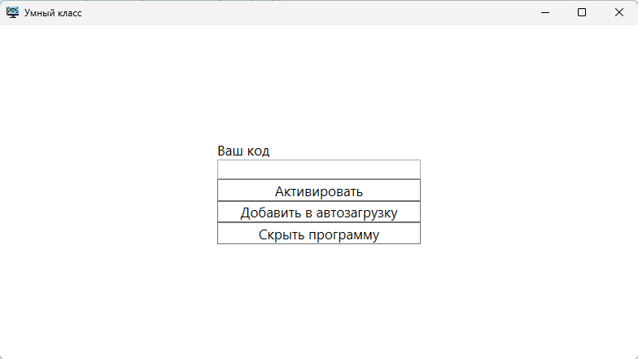

# Умный класс - Программа

"Умный класс" — это программа для управления компьютерами в учебных заведениях с возможностью удалённого мониторинга и контроля состояния устройств.

---

## **Описание функционала**
1. **Мониторинг компьютеров**  
   Программа позволяет отслеживать статус устройств через API, включая такие параметры, как:
   - Уникальный идентификатор компьютера (UUID).
   - Активность устройства.
   - Сигналы о состоянии устройства.

2. **Автоматические действия**  
   В зависимости от состояния компьютера, программа выполняет:
   - Воспроизведение звукового сигнала (если задан параметр `Signal`).
   - Автоматическое завершение работы компьютера (если `Is_active` равен `false`).

3. **Настройка автозапуска**  
   Возможность добавления программы в автозагрузку системы для обеспечения постоянного контроля.

4. **Гибкая настройка**  
   Пользователь может вручную задавать или изменять уникальный код компьютера (UUID).

---

## **Скачивание программы**

### Нажмите на ссылку ниже, чтобы скачать установочный файл **SmartClass.exe**:

> Замените `https://example.com/SmartClass.exe` на реальный URL для скачивания файла.

---

## **Интерфейс программы**

### Основные элементы:
1. **Поле для ввода UUID компьютера**  
   Используется для задания или изменения уникального идентификатора компьютера.
2. **Кнопка "Сохранить"**  
   Сохраняет введённый UUID.
3. **Кнопка "Добавить в автозагрузку"**  
   Позволяет включить/отключить автозапуск программы.
4. **Фоновый режим**  
   Программа может работать в фоне, обеспечивая постоянный мониторинг устройства.

---

## Частые действия
### Активация программы
1. Запустите файл SmartClass.exe.
2. Укажите уникальный UUID вашего компьютера в поле "Код".
3. Нажмите кнопку Сохранить. Программа начнёт отслеживать состояние устройства.
## Добавление программы в автозагрузку
1. Нажмите кнопку "Добавить в автозагрузки".
2. Чтобы убрать из автозагрузки, нажмите на неё повторно.

---

## **Технологии**
- .NET WPF C#

---

## **Разработчики**

- 124476
